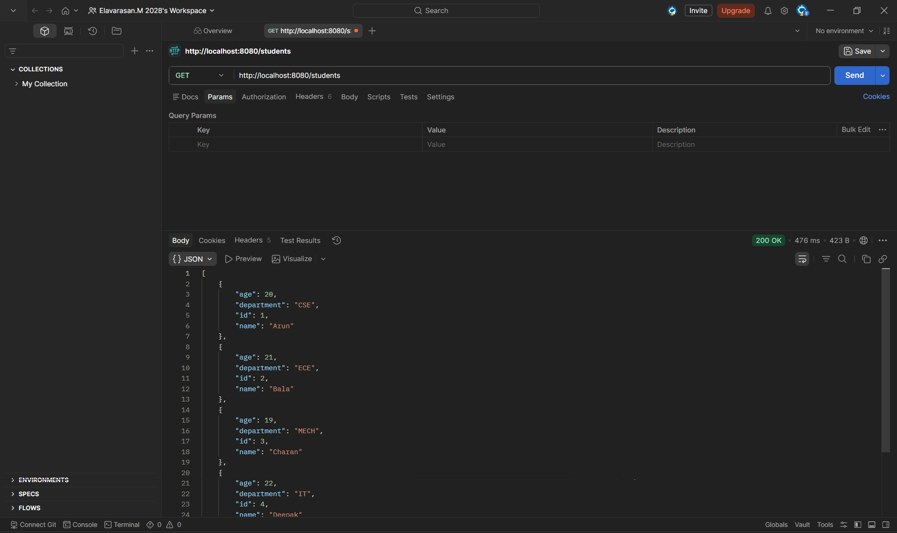
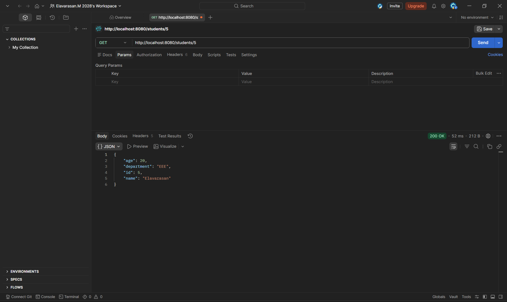

# EXp*03*-Entity-Student-and-build-a-CRUD-operations-using-Spring-Boot-Hibernate-Configuration

## AIM:

To develop a Spring Boot application that performs CRUD (Create, Read, Update, Delete) operations on a Student entity using Spring Data JPA (Hibernate).

## ALGORITHM:

1. Create Spring Boot Project
   - Add dependencies:
     - Spring Web
     - Spring Data JPA
     - H2 Database or MySQL
     - Spring Boot DevTools

2. Configure application.properties
   - Define database connection
   - Enable Hibernate auto DDL

3. Create Student Entity Class
   - Annotate with @Entity
   - Define fields with @Id, @GeneratedValue, etc.

4. Create StudentRepository
   - Extend JpaRepository<Student, Long> for CRUD methods

5. Create StudentController
   - Handle HTTP methods:
     - POST /students → Add student
     - GET /students → Get all students
     - GET /students/{id} → Get student by ID
     - PUT /students/{id} → Update student
     - DELETE /students/{id} → Delete student

##PROGRAM CODE

### pom.xml
```xml
<?xml version="1.0" encoding="UTF-8"?>
<project xmlns="http://maven.apache.org/POM/4.0.0" xmlns:xsi="http://www.w3.org/2001/XMLSchema-instance"
	xsi:schemaLocation="http://maven.apache.org/POM/4.0.0 https://maven.apache.org/xsd/maven-4.0.0.xsd">
	<modelVersion>4.0.0</modelVersion>
	<parent>
		<groupId>org.springframework.boot</groupId>
		<artifactId>spring-boot-starter-parent</artifactId>
		<version>4.0.6</version>
		<relativePath/> <!-- lookup parent from repository -->
	</parent>
	<groupId>com.example</groupId>
	<artifactId>crud</artifactId>
	<version>0.0.1-SNAPSHOT</version>
	<name/>
	<description/>
	<url/>
	<licenses>
		<license/>
	</licenses>
	<developers>
		<developer/>
	</developers>
	<scm>
		<connection/>
		<developerConnection/>
		<tag/>
		<url/>
	</scm>
	<properties>
		<java.version>17</java.version>
	</properties>
	<dependencies>
		<dependency>
			<groupId>org.springframework.boot</groupId>
			<artifactId>spring-boot-h2console</artifactId>
		</dependency>
		<dependency>
			<groupId>org.springframework.boot</groupId>
			<artifactId>spring-boot-starter-data-jpa</artifactId>
		</dependency>
		<dependency>
			<groupId>org.springframework.boot</groupId>
			<artifactId>spring-boot-starter-webmvc</artifactId>
		</dependency>

		<dependency>
			<groupId>org.springframework.boot</groupId>
			<artifactId>spring-boot-devtools</artifactId>
			<scope>runtime</scope>
			<optional>true</optional>
		</dependency>
		<dependency>
			<groupId>com.h2database</groupId>
			<artifactId>h2</artifactId>
			<scope>runtime</scope>
		</dependency>
		<dependency>
			<groupId>org.springframework.boot</groupId>
			<artifactId>spring-boot-starter-data-jpa-test</artifactId>
			<scope>test</scope>
		</dependency>
		<dependency>
			<groupId>org.springframework.boot</groupId>
			<artifactId>spring-boot-starter-webmvc-test</artifactId>
			<scope>test</scope>
		</dependency>
	</dependencies>

	<build>
		<plugins>
			<plugin>
				<groupId>org.springframework.boot</groupId>
				<artifactId>spring-boot-maven-plugin</artifactId>
			</plugin>
		</plugins>
	</build>

</project>

```

### application.properties

```java
spring.datasource.url=jdbc:h2:mem:testdb
spring.datasource.driverClassName=org.h2.Driver
spring.datasource.username=sa
spring.datasource.password=
spring.jpa.hibernate.ddl-auto=update
spring.h2.console.enabled=true
```

### Student.java

```java
package com.example.crud.model;

import jakarta.persistence.Entity;
import jakarta.persistence.GeneratedValue;
import jakarta.persistence.GenerationType;
import jakarta.persistence.Id;

@Entity
public class Student {

    @Id
    @GeneratedValue(strategy = GenerationType.IDENTITY)
    private Long id;

    private String name;
    private int age;
    private String department;

    // Default Constructor
    public Student() {
    }

    // Getters and Setters
    public Long getId() {
        return id;
    }

    public void setId(Long id) {
        this.id = id;
    }

    public String getName() {
        return name;
    }

    public void setName(String name) {
        this.name = name;
    }

    public int getAge() {
        return age;
    }

    public void setAge(int age) {
        this.age = age;
    }

    public String getDepartment() {
        return department;
    }

    public void setDepartment(String department) {
        this.department = department;
    }
}
```

### StudentRepository.java

```java
package com.example.crud.repository;

import com.example.crud.model.Student;
import org.springframework.data.jpa.repository.JpaRepository;
import org.springframework.stereotype.Repository;

@Repository
public interface StudentRepository extends JpaRepository<Student, Long> {

}
```

### StudentController.java

```java
package com.example.crud.controller;


import com.example.crud.model.Student;
import com.example.crud.repository.StudentRepository;
import org.springframework.beans.factory.annotation.Autowired;
import org.springframework.web.bind.annotation.*;

import java.util.List;
import java.util.Optional;

@RestController
@RequestMapping("/students")
public class StudentController {

    @Autowired
    private StudentRepository studentRepository;

    @PostMapping
    public Student addStudent(@RequestBody Student student) {
        return studentRepository.save(student);
    }

    @GetMapping
    public List<Student> getAllStudents() {
        return studentRepository.findAll();
    }

    @GetMapping("/{id}")
    public Optional<Student> getStudent(@PathVariable Long id) {
        return studentRepository.findById(id);
    }

    @PutMapping("/{id}")
    public Student updateStudent(@PathVariable Long id, @RequestBody Student studentDetails) {
        Student student = studentRepository.findById(id).orElseThrow();
        student.setName(studentDetails.getName());
        student.setAge(studentDetails.getAge());
        student.setDepartment(studentDetails.getDepartment());
        return studentRepository.save(student);
    }

    @DeleteMapping("/{id}")
    public String deleteStudent(@PathVariable Long id) {
        studentRepository.deleteById(id);
        return "Student with ID " + id + " deleted successfully!";
    }

}

```

### CrudApplication.java

```java
package com.example.crud;

import org.springframework.boot.SpringApplication;
import org.springframework.boot.autoconfigure.SpringBootApplication;

@SpringBootApplication
public class CrudApplication {

	public static void main(String[] args) {
		SpringApplication.run(CrudApplication.class, args);
	}

}

```
Output:






Result:
Thus the development of a Spring Boot application that performs CRUD operations is completed successfully